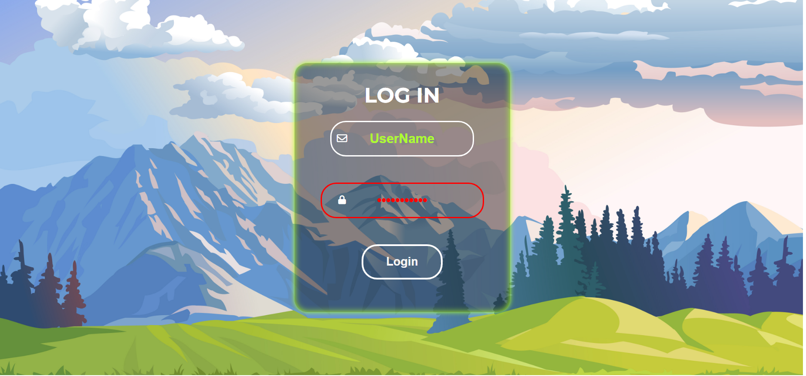

# Login Form



Simple Login Form.

## Description

This is a simple login form designed to allow users to securely access a website or application. The form typically includes fields for entering a username and a password, along with a submit button to initiate the login process. It may also feature validation to ensure that the input is correct (e.g., checking for valid username format or ensuring the password is strong). With an option to view the hidden password.

## Getting Started

### Dependencies

- A modern web browser (e.g., Google Chrome, Firefox, Edge)
- No special libraries or frameworks are required
- Operating system: Windows, Mac, or Linux

### Installing

1. Clone or download the repository to your local machine:

```sh
https://github.com/Ashutosh-88/simple-login-form
```

2. Navigate to the project folder in your terminal:

```sh
cd simple-login-form
```

3. Open the `index.html` file in your web browser.

### Executing Program

1. To open the app, simply open the `index.html` file in your browser.
2. The app displays a login form with input fields for the username and password, along with a login button.
3. The password field includes a lock/unlock icon, allowing the user to toggle between hidden and visible password text.
4. The user enters their username and password into the respective fields.
5. After entering the credentials, the user clicks the login button to submit the form.
6. If the credentials are valid, the user is logged in and redirected to the `demoSiteHome.html`. If invalid, it wont let you enter `demoSiteHome.html`.
7. The app remains on the login form, allowing the user to attempt login again or close the app.

## Help

If you run into any issues, ensure you are using a compatible browser and that JavaScript is enabled. If you need more help, please check the browser console for any error messages.

## Authors

- [Ashutosh Tiwari](https://www.linkedin.com/in/ashutosh-tiwari-70b504190/)

## Version History

- 0.1
  - Initial Release

## License

This project is licensed under the [MIT License](https://opensource.org/licenses/MIT) - see the LICENSE.md file for details.
